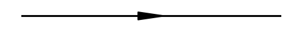
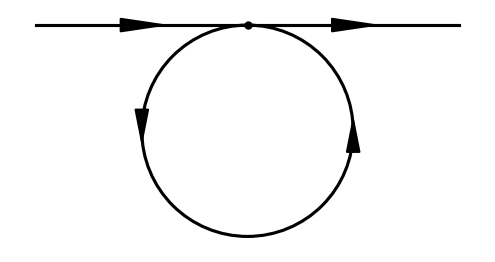
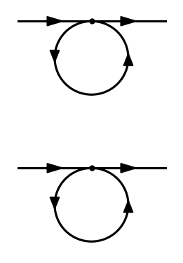
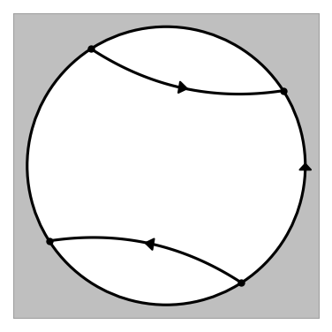
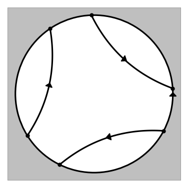
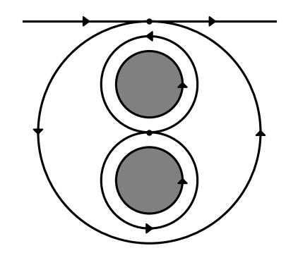
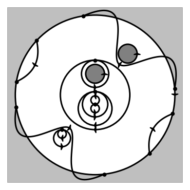

# visCOT

**COT（Combinatorial Orbit Topology）表記から流線図を自動生成する可視化ツール**

2次元多重連結領域上の構造安定な非圧縮流れのトポロジーを、COT木表現から自動的に描画します。
深さに制限はなく、再帰的に任意の深さの木を可視化できます。

## 出力例

| 一様流 `A0()` | 閉軌道を含む一様流 `A0(a+(l+))` | 2つの閉軌道 `A0(a+(l+).a+(l+))` |
|:---:|:---:|:---:|
|  |  |  |

| 鞍点結合 `B0+(l+,c-(l-,).c-(l-,))` | 3つの鞍点結合 | 障害物を含む流れ `A0(a+(b++(B+{},B+{})))` |
|:---:|:---:|:---:|
|  |  |  |

<details>
<summary>さらに複雑な例</summary>

| 入れ子の二分岐・障害物・鞍点結合 |
|:---:|
|  |

**COT式:** `B0-(b-+(b-+(l-,b++(l+,l+)),B+{}),c+(B+{},).c+(l+,).c+(b+-(l+,l-),).c+(l+,))`

入れ子の二分岐ノード、複数の障害物（内側境界成分）、連続する鞍点結合を含む複雑な流れ場も正確に可視化できます。

</details>

## 特徴

- **COT表記のパース** — PLY（Python Lex-Yacc）ベースのパーサで木構造を構文解析
- **自動レイアウト** — 高さベースのスペーシングにより流線の重なりを防止
- **スプライン補間** — scipy による滑らかな流線の描画
- **レイアウト最適化** — Nelder-Mead 法による自動パラメータ最適化
- **多彩な出力形式** — PNG, SVG, PDF, EPS に対応
- **対話モード** — 式を入力して即座にプレビュー

## Requirements

- Python 3.10+
- matplotlib 3.7+
- numpy 1.24+
- scipy 1.10+
- PLY 3.11+

## インストール

```bash
git clone https://github.com/yokoyama-lab/visCOT.git
cd visCOT
pip install -e . --break-system-packages
```

開発用の依存パッケージ（pytest, ruff, mypy）も合わせてインストールする場合:

```bash
pip install -e ".[dev]" --break-system-packages
```

## 使い方

COT木表現を標準入力から与えて可視化する:

```bash
echo "A0(a2(c+(l+,).c+(l+,),c-(l-,).c-(l-,)))" | viscot
```

ファイルに保存する場合:

```bash
echo "A0(a2(c+(l+,).c+(l+,),c-(l-,).c-(l-,)))" | viscot -o output.png
```

ベクター形式で出力する場合:

```bash
echo "A0(a2(c+(l+,).c+(l+,),c-(l-,).c-(l-,)))" | viscot -o output.svg
echo "A0(a2(c+(l+,).c+(l+,),c-(l-,).c-(l-,)))" | viscot -o output.pdf
```

対話モードで起動する場合:

```bash
viscot -i
```

## テスト

```bash
make test
```

## Lint

```bash
make lint
```
